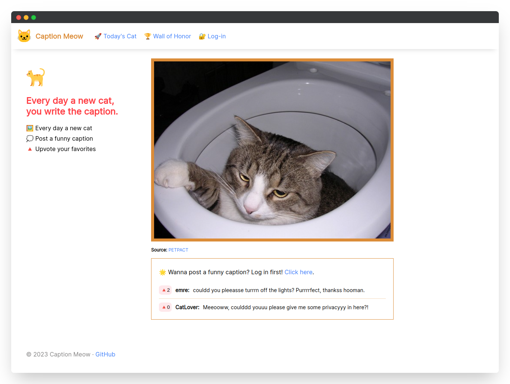

# 🐱 Caption Meow
Caption Meow is an **open-source** MIT-licensed social network for cat lovers!

## Introducing
The ultimate creative challenge! Every day, I provide a new photo and challenge you to come up with the wittiest, funniest, and most purr-fect caption you can think of.

My community is full of cat lovers who are always up for a good laugh, so join us and start your day with a smile right meow! You can vote for your favorite captions and compete with other users to see who can come up with the best one.

With Caption Meow, you'll never run out of hilarious cat-related content. So what are you waiting for? [Sign up](https://captionmeow.vercel.app/signup) now and let the fun begin!

I created Caption Meow inspired by the popular project [Caption Cat](https://www.producthunt.com/products/caption-cat) - I cloned it and added my own unique twist! I loved the idea of a community of cat lovers coming together to create funny and creative captions for adorable cat photos.

## Preview
Caption Meow can be used through the website address [captionmeow.vercel.app](https://captionmeow.vercel.app).

## Features
 - User Authentication: Users can register, login, and update their profiles.
 - Caption Voting: Users can vote for their favorite captions.
 - Post Caption: Users can post funny captions for cat images.
 - Leaderboard: Lists users with the most points and can be viewed by everyone.

## Screenshots


## Directory Structure
```bash
├── public
│   └── images
├── src
│   ├── components
│   │   ├── Aside.jsx
│   │   ├── Comment.jsx
│   │   ├── Header.jsx
│   │   ├── HonorUser.jsx
│   │   └── Layout.jsx
│   ├── context
│   │   ├── AfterLoginProvider.jsx
│   │   └── AuthProvider.jsx
│   ├── pages
│   │   ├── Home.jsx
│   │   ├── Login.jsx
│   │   ├── Settings.jsx
│   │   ├── Signup.jsx
│   │   └── Wall.jsx
│   ├── services
│   │   ├── cats.js
│   │   ├── comments.js
│   │   ├── firebase.js
│   │   ├── users.js
│   │   └── votes.js
│   ├── main.jsx
│   └── style.css
├── README.md
├── vercel.json
└── vite.config.js
```
- `public`: This folder contains static assets such as images used in the project.
- `src`: This is the main source code folder for the project.
  - `components`: This folder contains React components that can be used throughout the application, such as `Aside`, `Comment`, `Header`, `HonorUser`, and `Layout`.
  - `context`: This folder contains React context providers for managing state and passing data down the component tree, including `AfterLoginProvider` and `AuthProvider`.
  - `pages`: This folder contains the main pages of the application, including `Home`, `Login`, `Settings`, `Signup`, and `Wall`.
  - `services`: This folder contains JavaScript modules that provide functionality for communicating with external services or APIs, such as `cats`, `comments`, `firebase`, `users`, and `votes`.
  - `main.jsx`: This is the main entry point for the application.
  - `style.css`: This is the main stylesheet for the application.
- `README.md`: This is the README file that provides information about the project.
- `vercel.json`: This file contains configuration settings for deploying the project to the [Vercel](https://vercel.app) platform.
- `vite.config.js`: This file contains configuration settings for the [Vite](https://vitejs.dev/) development server.

## Installation
1. Clone the repository to your local machine:
```bash
  git clone https://github.com/emrecoban/caption-meow.git
```

2. Navigate to the project directory:
```bash
  cd caption-meow
```

3. Install the dependencies using `npm`:
```bash
  npm install
  npm i react-router-dom
  npm i firebase
  npm i react-firebase-hooks
```

4. Start the development server:
```bash
  npm run dev
```
5. Open your web browser and go to [http://localhost:5173](http://localhost:5173) to view the application.

> **Configure Firebase**
> Don't forget to configure the Firebase Config file (src/services/firebase.js)!

That's it! You should now have the project running locally on your machine. If you encounter any issues, be sure to check the project's documentation and issue tracker on GitHub.

## Contributing
Bug reports, feature requests, and pull requests are welcome. This project is intended to be a safe, welcoming space for collaboration, and contributors are expected to adhere to the [Contributor Covenant](https://www.contributor-covenant.org/) code of conduct.

## Built with
- JavaScript
- React
- React Router
- Vite
- React Firebase Hooks
- Firebase
  - Authentication
  - Cloud Firestore

## Support
- Sponsor to me on GitHub.
- Give a star to this repo.
- Upvote on [ProductHunt](https://www.producthunt.com/posts/caption-meow).
- Follow me on Twitter [@emreshepherd](https://twitter.com/emreshepherd), or GitHub [@emrecoban](https://github.com/emrecoban).
- Buy me a coffee, or book: https://www.buymeacoffee.com/emrecoban

## References
- [React Router](https://reactrouter.com/en/main)
- [useContext - React](https://react.dev/reference/react/useContext)
- [Firebase Authentication on Websites](https://firebase.google.com/docs/auth/web/start?hl=en)
- [Firebase Cloud Firestore](https://firebase.google.com/docs/firestore/quickstart?hl=en)
- [Learn React by Bob Ziroll](https://scrimba.com/learn/learnreact)
- [Learn React Router 6 by Bob Ziroll](https://scrimba.com/learn/reactrouter6)
- [Building Full Stack App by Tadnology](https://www.youtube.com/watch?v=KJYwdWZv98A)
- [Source of Inspiration: Caption Cat](https://www.producthunt.com/products/caption-cat)

## License
The Caption Meow is available as open source under the terms of the [MIT License](https://github.com/emrecoban/caption-meow/blob/main/LICENSE).
